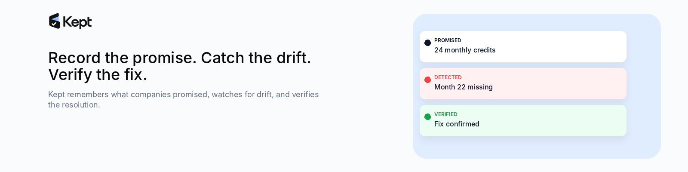
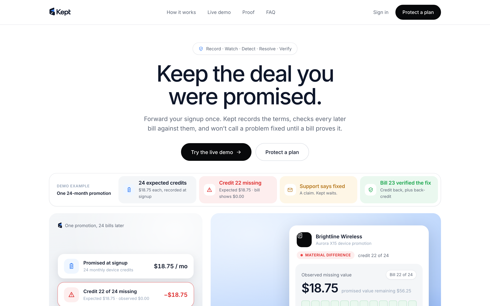
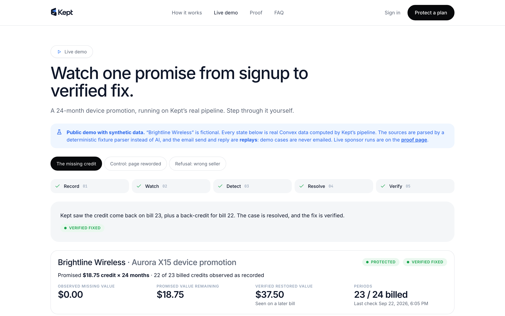
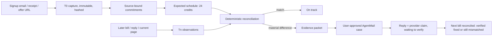

# Kept



**Record the promise. Catch the drift. Verify the fix.**

Kept records the deal you were promised when you signed up, checks every later bill against it, opens a source-backed case when a credit goes missing, and won't call it fixed until a later bill proves it.

> You were promised 24 monthly device credits. Bill 22 has none. Forward the signup once and Kept preserves the original offer, checks every bill, opens an evidence-backed case when delivery drifts, and waits for the next bill before calling it fixed.

- **Live app:** https://gregarious-snail-975.convex.site
- **Public demo (no sign-up):** https://gregarious-snail-975.convex.site/demo
- **Inspectable production run:** https://gregarious-snail-975.convex.site/proof/run/live-loop-2026-09-22
- **Demo video:** coming with the submission
- **Build log:** [hackathon.md](hackathon.md)
- **Architecture:** [docs/ARCHITECTURE.md](docs/ARCHITECTURE.md) · **Submission state:** [docs/SUBMISSION_CHECKLIST.md](docs/SUBMISSION_CHECKLIST.md)

| The promise, then the drift | Verified only by a later bill |
|---|---|
|  |  |

## For judges: two ways in

1. **No signup:** [/demo](https://gregarious-snail-975.convex.site/demo) runs the whole loop on synthetic data through the real pipeline, plus the control and refusal cases.
2. **The actual product:** create an account at [/signup](https://gregarious-snail-975.convex.site/signup), click Protect a plan, then paste a signup email and a bill or two. The same extraction, binding and reconciliation run on your own data; a verified judge walkthrough of exactly this path is in `docs/screenshots/07-real-app-material-difference.png`.

One honest limitation: the hackathon AgentMail plan allows three inboxes, so new accounts may not get their own forwarding address. The app says so plainly and upload/paste runs the identical pipeline. The live inbox round trip, send and reply is recorded at [/proof/run/live-loop-2026-09-22](https://gregarious-snail-975.convex.site/proof/run/live-loop-2026-09-22).

## The mechanism



Kept isn't a web monitor, a bill summarizer, or a complaint writer. It starts before any dispute: it keeps a dated record of what you were promised, turns explicit terms into expected events, and reconciles what actually happens against that record.

## Why this problem

Promotions like "$18.75 a month for 24 months" pay out over two years of bills. When a credit silently stops in month 22, the customer has to dig up the original confirmation, the offer page as it looked back then, and a stack of bills, then re-explain everything to support. And a support reply saying "it's been fixed" isn't the same as the next bill actually showing the credit.

## Product flow

1. Sign up and get your own Kept inbox, then forward the signup confirmation, upload it, or paste the offer page URL.
2. Kept stores each source unchanged, with a hash and capture time, and extracts the terms. Every term keeps the exact words it came from.
3. A recurring credit becomes an expected schedule. Each bill you forward or paste is matched to its period.
4. If a bill stops matching, the item shows the exact period, amount and evidence on both sides (**Then vs Now**).
5. Kept builds an evidence packet and a short support email. Nothing is sent until you approve it.
6. The reply lands on the same case. Kept records what the provider claims, then waits for the next bill to verify it.

## Decision primitive

> Given transaction-time evidence, later bills and messages, and current first-party terms, has the delivered outcome materially diverged from what was recorded at signup, and what evidence-backed next step is justified?

## Sponsor roles

| Sponsor | What it does in Kept | Code | Evidence |
|---|---|---|---|
| **Convex** | Canonical state, auth, immutable captures, file storage, scheduled pipeline steps, signed webhook route, state machines, reactive UI, static hosting, three components | `convex/` | the whole app; case page switches to verified with no reload |
| **Firecrawl** | Captures public offer/terms pages as T0 and later Tn snapshots | `convex/internal/sourceProcessing.ts` | two live immutable captures of a carrier deals page |
| **OpenAI** | Structured extraction of commitments, bill line items and reply claims, plus case drafting (`gpt-5.6-terra`, `gpt-5.6-sol`, Responses API, strict Structured Outputs) | `convex/lib/openai.ts`, `convex/lib/aiSchemas.ts` | [campaign report](evidence/campaign-report.md), [live run](evidence/live-roundtrip.md) |
| **AgentMail** | Per-user inbox for forwarded evidence, approved case sends with idempotency keys, replies in the same thread via signed webhooks | `convex/lib/agentmail.ts`, `convex/inbound.ts`, `convex/http.ts` | [live round trip](evidence/live-roundtrip.md) |

## Measured proof

From `evidence/campaign-report.json` (synthetic corpus, 52 live `gpt-5.6-terra` calls). The report shows every row.

| Measure | Result | Label |
|---|---|---|
| Deterministic decisions with a literal source excerpt containing the value | 68 / 68 | PROVEN_TEST |
| Supported-field precision / recall | 47 / 47 and 47 / 47 | PROVEN_TEST |
| Material page changes detected | 8 / 8 | PROVEN_TEST |
| Benign page rewrites ignored | 8 / 8 | PROVEN_TEST |
| Correct abstention on ambiguous or refusal cases | 10 / 10 | PROVEN_TEST |
| Provider claims falsely marked verified | 0 of 5 | PROVEN_FIXTURE |
| Live email round trip to verified fix | PASS | PROVEN_LIVE |

The first scoring of these same model outputs was worse: 2 / 8 benign rewrites wrongly flagged, 3 / 8 marked "can't tell", and 9 / 10 correct abstentions. Three deterministic fixes, each with a test, got it to the numbers above. The corpus is small and synthetic, and the fixes were found on it, so treat these as tuned results rather than a held-out benchmark. [Details](evidence/campaign-report.md).

Independent check: `npm run verify:evidence` re-derives 11 invariants from the corpus, the cached model outputs, and the pure decision code. It's currently **PASS** ([verification.md](evidence/verification.md)).

## Control and refusal

- **Control:** the offer page gets fully rewritten, with new headline, layout and copy, but the credit, duration and plan stay the same. Kept reports "The page changed. The deal didn't."
- **Refusal:** someone bought a phone from a marketplace seller and checks it against the carrier's own 30-day return policy. Kept reports "Kept can't establish this yet" instead of applying the policy.
- **Fail-closed, found live:** on the production run, the model labelled a one-time back-credit as a recurring credit. Kept saw the schedule conflict and refused to verify until a deterministic rule fixed the line identity.

## Sponsor ablation

[evidence/sponsor-ablation.md](evidence/sponsor-ablation.md). Without OpenAI, Kept's deterministic fixture parser correctly normalizes 8 / 22 of the heterogeneous corpus. Without Firecrawl there are no T0/Tn page captures or page comparison. Without AgentMail there's no forwarding address, owned support thread, or realtime reply.

## AI authority boundaries

- AI extracts, classifies, and drafts. Code decides money equality, deltas, schedules, dates, excerpt binding, state transitions, authorization, and duplicate-send prevention.
- A term the model can't quote from the source is rejected. Model confidence can only lower eligibility, never raise it.
- Drafts are checked in code: every amount, number and date must appear in the evidence packet, with no legal or threat language, or Kept falls back to a template.
- No email is sent without an explicit approval click. Replies are never answered automatically.
- Security review: [docs/THREAT_MODEL.md](docs/THREAT_MODEL.md). The official Convex reviewer's four High findings are fixed ([docs/DECISIONS.md](docs/DECISIONS.md)).

## Evidence artifacts

- [evidence/campaign-report.md](evidence/campaign-report.md), plus the [first run](evidence/campaign-report.first-run.json)
- [evidence/live-roundtrip.md](evidence/live-roundtrip.md)
- [evidence/sponsor-ablation.md](evidence/sponsor-ablation.md)
- [evidence/verification.md](evidence/verification.md)
- [docs/EVALUATION.md](docs/EVALUATION.md): the methodology, registered before the runs

## Development

```bash
npm install
npx convex dev            # links a Convex deployment and writes .env.local
npm run dev
npm test                  # unit + Convex function tests
npm run eval:fixtures     # re-score cached campaign results, no API calls
npm run verify:evidence   # independent verifier
npm run smoke:prod        # browser smoke tests against the live URL
npm run deploy
```

Server secrets are set with `npx convex env set` (names in `.env.example`): `OPENAI_API_KEY`, `FIRECRAWL_API_KEY`, `AGENTMAIL_API_KEY`, `AGENTMAIL_WEBHOOK_SECRET`.

## Limitations

- Kept only compares evidence it has captured or received. A current web page doesn't prove what the page said before Kept captured it.
- Logged-in carrier portals are out of scope.
- A material difference doesn't mean the provider made an error. There may be account facts Kept can't see.
- Kept doesn't give legal advice or decide what anyone is owed.
- All evaluation data is synthetic, and the providers are fictional. The live run used synthetic documents over real AgentMail inboxes the builder controls, and the "support" reply was written by the builder.

## License

Code is MIT licensed, see [LICENSE](LICENSE). The Kept name, logo and mark in `public/brand/` are brand assets: reuse the code freely, but not the identity.
