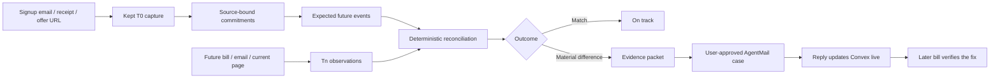

# Kept

**Record the promise. Catch the drift. Verify the fix.**

Kept records the deal you were promised at signup, turns it into a schedule of what should happen, checks every later bill against it, and won't call a problem fixed until a later bill proves it.

> You were promised 24 monthly device credits. Bill 22 has none. Forward the signup once and Kept preserves the original offer, checks every bill, opens a source-backed case when delivery drifts, and waits for the next bill before calling it fixed.

- Live app: not deployed yet
- Demo video: not recorded yet

## How it works



This README is being built out gate by gate. Measured results appear here only after they exist in `evidence/`.

## Development

```bash
npm install
npx convex dev      # creates/links a Convex deployment and writes .env.local
npm run dev
npm test
```

Server-side secrets are set on the Convex deployment with `npx convex env set`. See `.env.example` for names.
